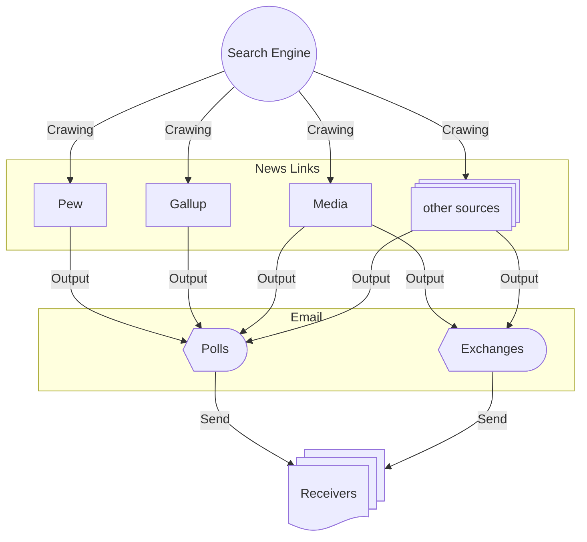

# Crawling Daily Survey, Poll & Exchanges News of the Cross-Strait Issues

## Introduction

The repo aims to obtain the daily news of **the latest survey or poll** on the cross-strait issues and **the cross-strait exchanges** among the local governments automatically by means of web scraping.

## Programming Schedule

- The program executes via the scheduler ``Cron``.
- The scheduling time: every **UTC+8** ``4 a.m.`` ``7 a.m.`` ``12 p.m.``
- Crawing the news published ``24 hr`` ago.

## Diagram

The processing workflow shows below:

